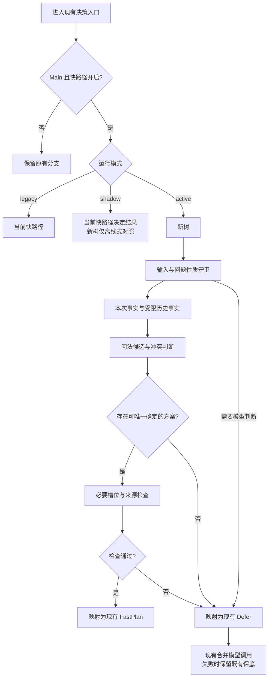

# Main 意图决策树重新设计方案

日期：2026-10-01。状态：设计完成，尚未实施。

用户已决定放弃移植旧决策树包，按当前系统重新设计。本方案覆盖 Main 后端的确定性决策层；不启动此前取消的定时任务，不代表运行时已切换到新树。

## 1. 目标与边界

把现有快路径整理成可以逐层解释、检查冲突、独立评估的规则决策树。确定性接管必须同时确定意图、问题性质和必要槽位；无法确定时沿用现有模型决策链。

实施按两类变更分批交付：先整理结构、保持行为，再处理歧义和覆盖缺口。这样可以分别回答“重构有没有退步”和“新规则是否有价值”。不把节点数量、接管比例或减少模型调用作为单独的成功标准。

约束依据：[后端并行开发边界](backend-parallel-development-boundaries.md)、[UI 设计边界](ui-design-boundaries.md)。本任务没有 UI 或参考图实现内容。

- 不修改 Android、WebUI、视觉夹具、验收工具、版本、签名、安装包及启动配置。
- 不改变聊天路径、请求字段、Intent 枚举、SSE 事件、`planner` 对外取值及 `schema_version: 1`。
- 保留现有 BYOK、错误和取消行为，保持结构化查询的事实来源及日期/参考时刻语义。
- Main/LM 共用部分需要明确隔离：LM 始终使用原快路径和原模型决策；不改 LM 专属实现或配置。
- 只在独立后端工作树实施；本轮仅新增本文，不修改共同文档索引和运行源码。

## 2. 当前系统基线

| 事实 | 当前实现依据 | 设计含义 |
| --- | --- | --- |
| 决策已有三级保底：快路径 → 一次合并模型调用 → 分类和抽槽两次调用 | `backend/app/pipeline/planner.py` | 树只替代第一级，不重写模型层 |
| 快路径同时产出 intent、question_type、Slots，或 Defer | `backend/app/pipeline/fastpath.py` | 不能只判标签，把槽位正确性留给猜测 |
| 问法关键词与必要槽位双命中；知识词、非铁路交通等可交出 | `fastpath.plan_with_reason()` | 已有守卫及问法优先级先逐条保留 |
| 历史只取最近三轮用户消息，本次值优先；意图继承最多一层 | `_history_user_turns()`、`_inherit_plan()`、`_merge_inherited()` | 不拼接全部历史，不从助手回答取实体，不添加会话状态存储 |
| 区间、站名、线路及日期已有解析器和权威数据 | `app.od`、`app.dates`、`fastpath`、`tools._rt12306` | 复用现有解析能力，避免维护第二套词典和解析口径 |
| Main 在确定性决策未命中后通过请求级回调启动最多一个预取 | `orchestrator._decide_with_prefetch()`、`planner.on_llm_decision` | 树和旁路评估不得触发工具；最终交回模型时才触发现有回调 |
| 流式入口传入 display_action，检索层优先使用其参数覆盖计划；块式入口当前不传动作 | `api/chat.py`、`retrieve.py` | 动作不由自然语言树重解释；动作绕过模型、块式补齐动作均不包含在首期 |

### 已有评估证据及限制

2026-10-01 的离线复核：当前 `test_corpus.py` 全部 549 项断言通过，其中冻结意图语料为 192 条。按现有测试口径，当前快路径接管 79 条，意图/路由/受约束槽位无不一致。

仅作废案兼容性调查：向旧包注入当前车次、车型、站点、线路、区间解析器后，旧树接管 69 条，有 13 条与当前契约不一致，涉及 8 条应接管而交出、3 条应交出而接管、2 条意图不一致；其中一条同时有槽位不一致。比较未要求不同版本的降级原因码相同，也未运行旧补丁的完整集成。该结果不能作为新树性能基线或真实用户准确率。

冻结语料来自已确认的回归样本，并非独立准确率评测。192 条中有 55 条 fastpath、79 条 llm、58 条 either，24 条带历史。`route=either` 的现有测试主要约束接管后的意图，不严格约束全部槽位和问题性质；部分标注包含非运行时值 `question_type=either`。`route=llm` 只证明快路径交出，未证明后续模型语义正确。不能将“回归全绿”解释成完整语义正确性。新评测须补充独立、可明确标注的样本，保留原回归文件。

最近性能复核每轮 20 次请求共 25 次模型逻辑调用，没有因优化减少调用总数；见[后端优化报告](backend-optimization-2026-10-01.md)。树结构本身不直接减少模型调用：只有正确接管原本交给模型的输入，才有这类收益。生成阶段仍需模型，不能承诺整轮问答达到毫秒级。

## 3. 决策结构

这是人工规则树，不引入分类器训练、通用 JSON DSL 或站点表编译成上千业务节点。每个节点是一项明确的判断；站名查找等事实抽取仍是解析器职责。

图中为目标结构。第一批的每个判断保持当前顺序和结果，不能借整理结构提前增加守卫。后续新增冲突节点或调整优先级均属于单独的行为变更。

### 3.1 输入与问题性质

保留现有空输入、超过 120 字、知识/开放型、非铁路交通守卫。树的 `defer` 表示规则无法可靠接管，不表示用户输入无效，也不新增 HTTP 拒绝行为。

知识型与混合问题仍交给模型；不靠出现车次号就强制判成 `realtime`。`question_type` 会决定是否检索知识来源、是否允许结合模型知识，误判不能视为次要标签问题。涉及停运、调图、实际到点和位置的判断不能以无记录、图定时刻或历史交路代替实际运行事实。

第一批不修改 `EMPTY` 同时用于空输入和过长输入的兼容原因。内部可分别记录 `input.empty`、`input.too_long`；对外保持原原因和文字。

### 3.2 事实抽取与来源

每个候选事实在内部记录：种类、值、来自本次或哪一轮用户消息、是否通过现有解析器校验。字符区间仅在当前解析器能提供时记录，不为获得轨迹而另写一套抽取器。

| 内部事实 | 复用能力 | 首期要求 |
| --- | --- | --- |
| 车次、车型、车组 | 当前 `_train_code()`、`_emu_model()`、`_target_of()` | 保留型号边界防护；`CR400AF-5054` 不能误解成车次 400 或 5054 |
| 站点 | `ensure_loaded()`、`station_name_set()`、现有最长匹配及多站点检查 | 数据不可用时标记能力缺失，不补入旧包的备用站点表 |
| 区间 | `app.od.parse_od()`、`_plausible_od()`、`_merge_od()` | 保留方向和真实站名检查；不能把到达屏、城市景点问路当作铁路区间 |
| 线路 | 当前 `_line_in_text()` 与本地线路表 | 保留规范名，不用手写别名覆盖权威库 |
| 时间 | 当前 `_time_phrase()`；下游 `app.dates.resolve_date()` | 首期保留 Slots.time 原有表示，不在树内静默改成 ISO 或今天 |
| 席别、时段、车种等过滤条件 | 当前检索解析口径 | 首期不修改 extra 或另写筛选器；覆盖扩展前核对检索能否消费 |

树不获取真实时刻、余票、交路或开行事实，不调用 `invoke_by_name`、外部 HTTP 或模型。站点加载只使用包内静态数据。输入事实、历史索引及轨迹均为请求局部数据，不能放进进程级可变缓存。

### 3.3 问法家族与槽位要求

首期沿用当前家族和优先级，必要槽位以当前实际分支为准：

| 家族 | 现有 intent | 关键事实 / 槽位落点 |
| --- | --- | --- |
| 担当、车底、交路 | emu_routing | 车次或车型/车组 → target；保留两者共现时的既有选择 |
| 经停、历时、车次时刻 | schedule | 车次 → target；站名存在时仍落入 location；到点红线先判断 |
| 大屏、检票口 | station | 站名 → location |
| 区间余票、票价 | ticket | 区间 → direction；票价和余票的具体工具分派仍归检索层 |
| 里程、径路 | rail_line | 线路 → target 或区间 → direction |
| 沿线车站 | rail_line | 线路 → target，不能因含“车站”而落入 station |
| 单站档案 | station | 站名 → location |
| 拍车、机位 | photo_spot | 地点 → location，可选车型 → target；当前工具组及生成预算不变 |
| 多轮省略 | 继承既有意图 | 最近可确定的一轮 + 本次明确新槽位，按现有合并策略产出 |

每条规则声明稳定 `rule_id`、所属家族、关键词谓词、必要事实、结果构造函数和可兼容的竞争规则。声明采用 Python 类型及函数；不引入自定义规则语言、动态表达式执行或在线编辑规则功能。

内部增加操作分类，区分 `train.stops` / `train.timetable`、`ticket.availability` / `ticket.fare`、`station.screen` / `station.profile`、`rail.stations` / `rail.mileage` 等；它们仅用于候选消歧和评估，统一投影回当前八个 Intent。操作不是新增工具名称，也不能在第一批改变检索层对票价/余票等的分派。多候选先保留，不能因为对外只有一个 intent 就在识别阶段删掉其他诉求。

规则顺序集中维护。初始化时检查 ID 重复、Intent/QuestionType 非法、槽位键非法和引用不存在；这些检查保证规则配置有效，不能代替语义评测。规则规模由实际覆盖需要决定。

### 3.4 冲突处理

第一批仅记录竞争候选，最终仍按当前顺序取结果。第二批开始才引入明确的阻断及优先关系：

- 同义候选产出相同意图、性质和关键槽位：可合并。
- 明确主对象是线路且要求沿线站点：线路家族优先于单站家族；仅提到两个站名不能自动证明这是一条完整区间诉求。
- 拍车句中的车型或担当词，可能只是拍摄目标，不应自动抢占拍摄主诉求。只有有限、已验证的句式可以判定主诉求；其余交回模型。
- 多个独立诉求、实时与知识混合、否定/更正关系不清、多车次及多日期无法唯一绑定：交回模型。不能取第一个关键词或第一个车次冒充完整计划。
- 多车次的既有批量检索仍保留；是否扩大确定性接管单独评估。树内部候选列表不是对外新增多意图协议。

所谓高置信是“守卫通过、对象明确、槽位充分、来源可靠、无未解决竞争”这些可检查条件，不输出未经校准的 0.95 等概率。

### 3.5 多轮与日期

第一批逐项复制当前继承策略的行为：最近三轮用户消息、本次优先、助手消息不供槽位、历史意图最多一层、纯指代交回模型。不同历史消息补齐字段的现状先保留，并记录来源；发现跨话题拼接风险后，在第二批增加独立守卫，不偷偷改成另一种继承算法。

“改成上海呢”承接北京→南京可以按既有语义替换终点；“从上海走呢”应替换起点。出现多站名却无法确认区间时不能沿用上文拼出错误方向。

时间冲突首期继续交回模型。例如当前 `_merge_inherited()` 在旧日期与新日期不一致时会交出，即使“那明天呢”看起来明确。不能宣称当前已能自动处理所有更换日期。将“明确换日期”与“明天上午 → 那下午呢”分开处理属于后续扩展。

后续时间扩展须保留“没说日期”“明确日期”“说了但未识别”“只说时段”的区别。仍以 `resolve_date` 为权威，不在树中自建日历或节日映射。日期、时段拆分和新增识别结果先用于内部诊断；不把历史记录的日期或助手提及的日期当成本次查询日。

## 4. 内部接口与集成

建议新增 `backend/app/pipeline/decision_tree/`，最小组成：

| 文件 | 责任 |
| --- | --- |
| `types.py` | 请求事实、规则、决策与有界轨迹的数据类型 |
| `facts.py` | 适配当前解析器、标记来源及可用能力；首期可引用 fastpath 私有辅助函数，避免移动共享解析逻辑影响 LM |
| `rules.py` | 现有家族、顺序、必要槽位及明确的竞争关系 |
| `engine.py` | 走树，输出 plan/defer，适配现有 FastPlan/Defer |
| `diagnostics.py` | 仅内部的差异比较、脱敏汇总及耗时统计 |

唯一首期生产接入点为 `planner.py` 的确定性分支；保留 `decide(message, history)` 的五项返回值及 `fastpath.plan_with_reason()` 原入口。不能把新树接进 `rule_slots()` 或 mock，顺带改变另一条路径。旧实现保留供 LM、回滚和对照使用。

测试替身须按模式明确接入：legacy/LM 仍替换旧入口，active 替换新引擎或 planner 内部统一分派入口；shadow 必须屏蔽或控制两条本地分支。不能假定 patch 旧 `fastpath.plan_with_reason` 就屏蔽了新树，避免旧案中“替身静默失效、测试实际调用模型”的问题。运行测试时明确模式，并阻断不需要的外部调用。

内部 Decision 建议包含：`action=plan|defer`、现有意图/性质/Slots、兼容 Defer、固定原因码、命中 rule_id、竞争 rule_id、槽位来源、规则版本及耗时。只有现有字段映射到流水线；新诊断字段不进入 `done`、`slots.raw`、展示协议或客户端可见日志。

### 运行模式（待实施）

建议使用后端内部环境项 `MAIN_INTENT_TREE_MODE=legacy|shadow|active`，默认 `legacy`；不改 UI 设置或启动脚本。实现时解析非法值应回到 legacy 并记录固定诊断码。它不是本轮已经存在的配置。

| 条件 | 行为 |
| --- | --- |
| LM | 原实现；不建树，不采集新树诊断 |
| FASTPATH_ENABLED=false | 沿用现有直接走模型的语义；新树和影子均不运行 |
| legacy | 原快路径 |
| shadow | 原快路径决定结果；新树只比较 plan/defer、意图、性质、槽位与原因 |
| active | 新树决定第一级结果；交出后进入现有模型链 |

shadow 不调用两遍 planner，不请求第二份模型答案，不预取、不检索、不生成；只计算一次本地新树并记录有限差异。在请求内完成，不留下取消后继续运行的后台任务。原快路径仍是该模式下唯一生效的决策。

active 中新树发生普通异常时，记录固定 `ENGINE_ERROR`，尝试原快路径；原快路径也不能决定时，才走既有模型链。取消异常和生成器退出必须直接向上传递，不能被“回滚”捕获后启动模型。规则构建只在 Main 第一次需要时进行，构建失败回到 legacy；不增加应用启动阻塞任务。

最终只有真正交回模型时调用 `on_llm_decision` 一次，复用已有最多一个预取、规范参数匹配和清理流程。树模式不能绕过请求级供应商 ContextVar，不改变模型故障的诚实降级。

display_action 继续由当前检索层处理，结构化参数在现有动作覆盖位置优先于文本和树的槽位；流式动作不启动无关预取。首期不改变其仍经历 planner 的现状，不扩展块式动作行为。

这不是完整的动作隔离保证：模型不可用仍可能阻止动作进入检索；`retrieve.py` 在动作覆盖计划之后，还会依据 message 增加站档/大屏等工具，或依据意图扩展车组相关查询。因此不能宣称现有定向动作始终只执行载荷对应的封闭计划。

后续动作专项的目标应是“动作校验 → 固定对象与日期 → 唯一计划 → 现有执行与投影”，不再由按钮文案、模型或历史扩大对象范围。非法载荷、取消、失败项重试及当前错误交付须逐项设计；不在树重构中偷偷新增错误状态或更改现有载荷处理。该专项需要最小编排分流和检索计划边界改造，独立于首期兼容树。

## 5. 解释、度量与资源预算

生产只保留固定 ID、枚举、来源轮次与计数，不持久化用户原话、完整历史、实体值、URL、供应商密钥或模型输出。含输入的完整解释只用于明确提供的离线评测样本，不默认保存生产内容。

轨迹按需开启，最多 32 条摘要；超出时保留总步骤数及截断标记。计数标签仅取固定规则、固定原因、模式和版本。汇总延迟窗口沿用有界原则；本方案不新增监控 HTTP 端点或修改已冻结响应结构。

| 指标 | 口径 |
| --- | --- |
| 确定性接管率 | 接管条数 / 全部评测条数，另按意图、单轮/多轮拆分 |
| 接管正确率 | 意图、问题性质和受约束槽位均正确的接管条数 / 接管条数 |
| 错误接管 | 应交出或关键语义错误却接管；与漏接管分开报告 |
| 必要槽位正确率 | 对接管样本检查关键值、来源、区间方向及日期语义；不能只看非空 |
| 工具计划正确性 | 对离线集成样本比较完整工具及参数，记录无关工具、过滤丢失、日期错误和动作范围扩大；不因树标签正确就视为通过 |
| 兼容差异 | 新旧 plan/defer、intent、question_type、全部 Slots、兼容原因与文字的差异；注明预期/非预期 |
| 调用与成本 | 决策模型调用、生成模型调用、工具调用、token 分开；模型故障不记成成功节省 |
| 本地开销 | 初始化耗时/RSS、热运行 p50/p95、历史继承耗时、轨迹开启增量 |
| 用户结果 | 同场景卡片交付、首个可见正文、整轮 p50/p95，以及失败、降级、取消 |

建议初始性能门槛：固定机器、相同语料、预热后，active 本地判定 p95 相比原快路径增加不超过 5 ms，shadow 整体本地决策 p95 增量不超过 10 ms。它们是待验证的验收预算，不是测量结论；冷启动和常驻内存另外报告。真实云端与铁路测量保持独立端口、交替对照，并注明数据源与缓存变化；离线改善不能直接外推到端到端收益。

## 6. 验证计划及准入

### A. 保持行为的结构整理

在独立工作树建立特征样本：当前冻结 192 条意图、86 条说法、手写快路径用例及现有生成语料。先固定源码/语料哈希与当前结果，再做新旧差异比较。对当前存在缺口的候选只比较结果，不擅自将其设为新树准确率真值。

准入要求：

1. 当前回归全部通过；新旧 plan/defer、意图、性质、五个槽位及兼容降级原因无非预期差异。FastPlan 命中说明及 matched 日志也需核对，不能因为是“日志”就任意改变客户端可见内容。
2. 确定性接管实际零模型/零工具调用；shadow 不增加任何上游调用，异常不改变原结果。
3. LM、快路径关闭、非法模式、异常回退、请求取消及并行请求均覆盖；状态不串请求。
4. 性能预算通过，树异常不会变成新的 500 或错误成功。

### B. 安全与覆盖扩展

另建人工复核语义集与保留集，按问法家族划分；同一模板的改写不能同时用于补规则和证明泛化。至少覆盖：纯知识、混合诉求、线路/车站竞争、车型/车次边界、否定更正、站名同形普通词、城市交通、多车次/多日期、非法日期、纯时段和多轮换对象。

典型必须包含的对照：

| 输入/上下文 | 要检查的行为 |
| --- | --- |
| G1 经停哪些站 / 京沪线沿线有哪些车站 / 北京南站电报码 | 同含站点概念，分别路由到 schedule、rail_line、station |
| CR400AF-5054 今天跑哪趟 / CR400AF 牵引功率是多少 | 车型编号不截成数字；技术参数交回模型 |
| D301 实际到站时间和时刻表差多少 | 不把图定查询包装成实际到点或正晚点 |
| 在济南站下车去大明湖怎么走 / 北京到上海的机票多少钱 | 不按铁路区间或余票接管 |
| 北京到南京明天还有票吗 → 改成上海呢 | 保留北京→上海及明确查询日期 |
| G1 明天上午还有二等座吗 → 那下午呢 | 不悄悄变为今天；未设计清楚日期合并前交回模型 |
| G1 和 G2 明天经停哪些站 | 不因单一 target 丢失第二个车次；检查既有批量检索 |
| 本次明确车型，助手上一轮给出另一车组 | 不从助手答案继承或覆盖本次实体 |
| 文本与 train_schedule_batch/emu_routing 动作参数冲突 | 动作仍使用原载荷，日期和重试范围不由树扩大 |

每一批行为变更需列清旧结果、新结果、为何改变、必要工具是否存在、卡片与知识来源是否正确。对独立复核集中明确应交出的样本要求零错误接管；新增接管样本必须同时满足意图/性质/必要槽位正确，不能靠改期望、删样本或将问题都交出获得“提升”。收益及准入结论仅对该评测范围成立。

回归重点：`test_perf_fastpath.py`、`test_corpus.py`、`test_pipeline.py`、`test_orchestrator_semantics.py`、`test_cost_governance.py`、`test_pipeline_performance.py`；按变化追加现有日期、区间、线路和批量展示测试。新增测试验证交叉诉求、事实来源和真实调用边界，不逐个复述节点实现。

`test_structured_sse_visibility.py` 会写入前端视觉夹具，只能在隔离工作树运行；不能在共享原工作区执行并覆盖前端产物。API/SSE/展示投影验证使用受控假工具，但仍调用真实入口。另排云端验证时，再区分离线通过与真实查询通过。

## 7. 分阶段交付与回滚

| 阶段 | 交付物 | 完成门槛 |
| --- | --- | --- |
| 0：本轮设计 | 本文；当前代码/边界审查 | 不改运行行为，明确实施文件及验收口径 |
| 1：兼容原型 | 独立树模块、离线差异工具、必要测试；不接生产 | 满足 A 的离线语义和性能门槛 |
| 2：Main shadow | planner 最小模式分派、脱敏汇总 | 原输出与调用链不变；差异均有解释，LM 不变 |
| 3：Main active 兼容版 | 新树执行现有规则，原实现保留 | 集成、供应商隔离、取消和展示回归通过 |
| 4：安全增强与覆盖 | 分批新增冲突守卫、明确换槽位和经过核对的问法 | 每批满足 B，不捆绑改语料口径和结构 |

回滚只改变 Main 内部模式到 legacy，或移除本任务的 planner 分派；不改变客户端、端口、模型配置、检索缓存或共享查询。active 回滚不能中断已在执行的其他请求；不删除旧快路径。首期保留少量兼容适配的维护成本，后续是否合并共享辅助函数须另评估 LM 影响。

拟修改范围：新 `pipeline/decision_tree/`、新离线评估脚本和测试，最小修改 `planner.py`，必要时只增加内部诊断计数；`orchestrator.py` 不作为首期必改文件。不得直接应用旧压缩包补丁。所有实际文件变更在实施开始前重新核对并行编辑状态。

## 8. 本轮结论与剩余决策

只读交叉审查确认了以下风险，按阶段分别处理，不能用新树包装后就宣称已修复：

| 风险 | 当前依据 | 处理安排 |
| --- | --- | --- |
| 不同历史话题逐槽位拼接 | `fastpath.py` 在意图判定前分别回看最近三轮 | 兼容阶段记录来源；第二批要求唯一任务帧及话题切换守卫 |
| OD 返回字符串不等于真实铁路区间 | `od.parse_od()` 引导校验失败仍可退回规则结果，`_merge_od()` 部分路径会采信 | 第二批区分候选与可执行区间；数据不可用时不提升置信度 |
| 日期、时刻、车组数字可能被当车次 | 当前允许裸数字车次，实体保护不覆盖所有语境；这是静态风险，未声称全部已复现 | 独立对抗样本验证；后续先保护实体片段再判断数字车次 |
| 领域排除关键词过宽 | `_NON_RAIL_RE` 包含“客车”，可能覆盖铁路普速客车语境 | 第二批按上下文检查铁路/非铁路，不能直接删守卫 |
| 分类正确仍可能形成错误工具计划 | 检索层再次修槽、补工具和扩对象 | 离线验证真实检索计划；必要的计划边界改造另列专项 |
| 模型输出不等于已确认事实 | 原模型层校验输出结构，随后由检索层解释 | 后续统一候选/槽位验证需要对模型分支单独回归，不在首期改变模型保底 |

兼容阶段刻意复现当前行为不等于认可上述风险。active 兼容版也不代表安全增强完成。新增守卫修复已知错误时允许有列明的预期差异，并以独立语义样本和工具计划证据验收。

采用“小规模判断层 + 现有解析器 + 明确 plan/defer + 可回滚模式”的方案。第一批衡量兼容性与可解释性，第二批衡量安全性及有用覆盖；不把词表大小或业务节点数量作为目标。

当前可以明确进入兼容原型设计，没有需要客户端配套升级的字段。实施前仍需固定独立工作树的源码/语料快照，并从新旧差异中形成特征样本。独立语义集的模糊条目应标为待定，不能为了扩大覆盖擅自指定唯一意图。

动作直接决策、块式动作能力、节日/复杂日期解析扩展、纯知识确定性分类、多意图输出协议、删掉旧快路径和 LM 接入均不属于首期。它们需要各自的业务依据和验证，不能随决策树重构一并推进。
